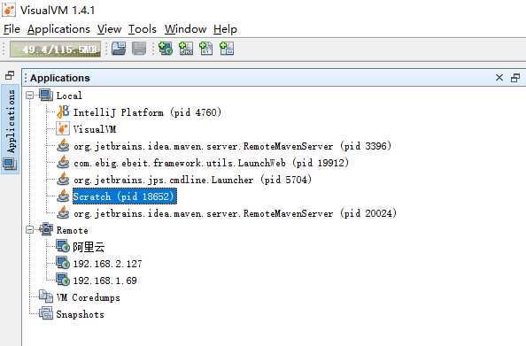
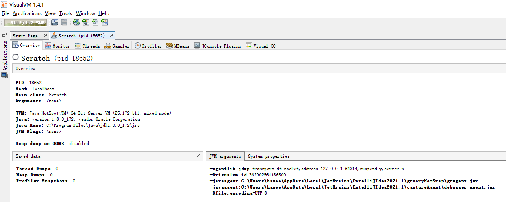
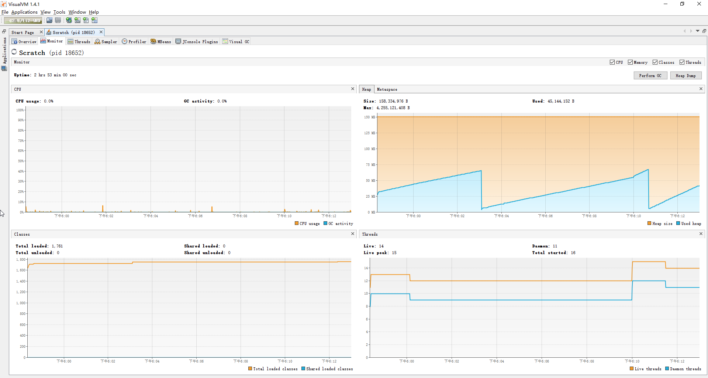
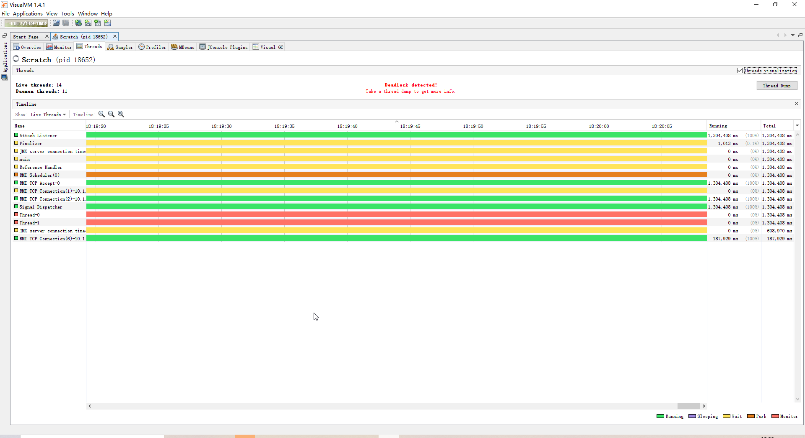
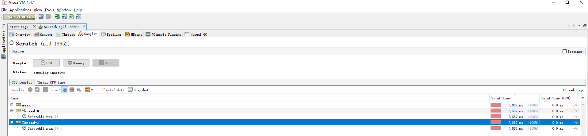
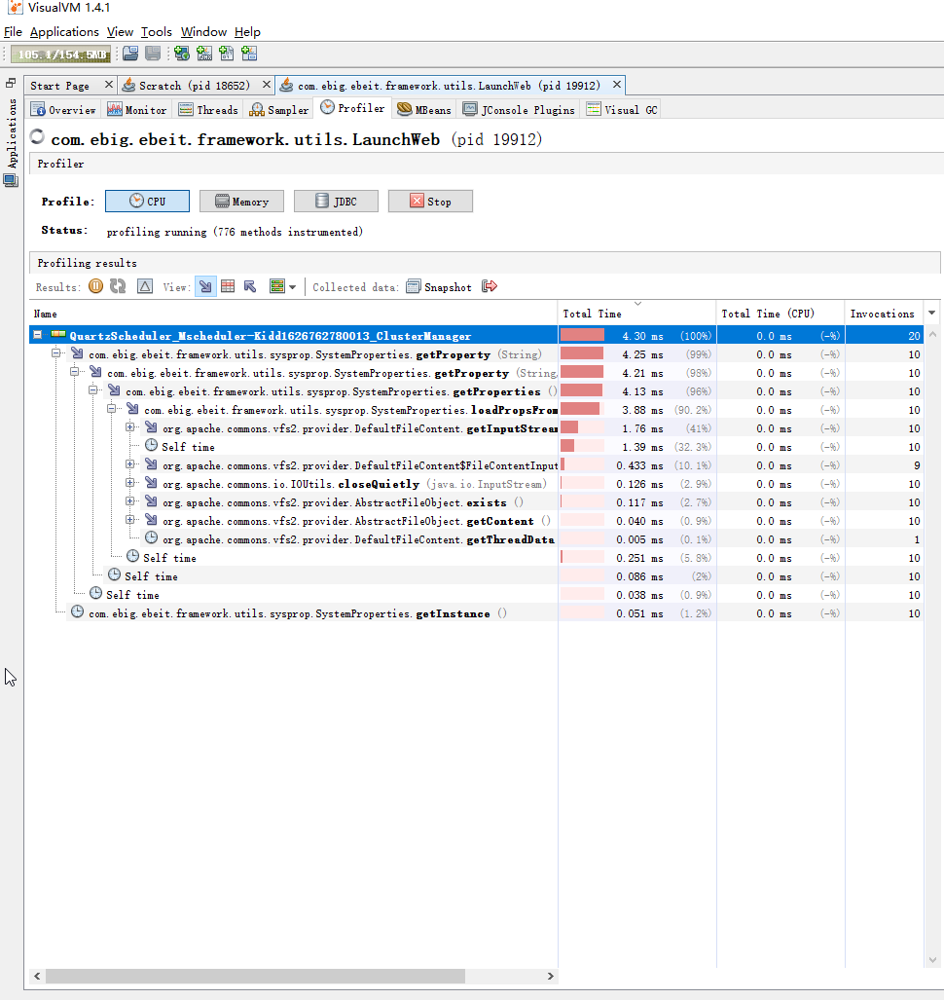
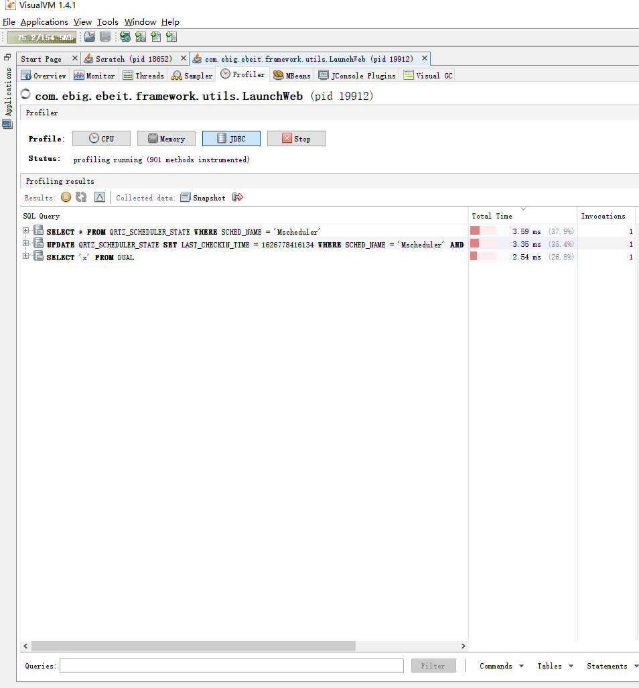

# JDK 常用工具介绍
[TOC]

JDK在安装后，在bin目录中内置了一些工具，可以帮助我们定位Java程序中遇到的问题。
下面介绍几个常用的工具：

## 1. jps 查看进程

jps全程为Java Virtual Machine Process Status Tool，是用于显示当前所有java进程的命令，可以察看当前系统所有java进程的一些简单情况。

jps的用法较为简单，命令行说明如下：

```shell
usage: jps [-help]
       jps [-q] [-mlvV] [<hostid>]

Definitions:
    <hostid>:      <hostname>[:<port>]
```

参数 | 说明
- | -
-q | 仅输出pid
-m | 输出pid，入口类名，main函数参数
-l | 输出pid，入口类全限定名
-v | 输出pid，入口类名，JVM参数
-V | 输出pid，入口类名（与不带参数一致）
hostid | 远程jvm的地址，需要远程jvm开启rmiregistry进程

参考说明：https://docs.oracle.com/javase/8/docs/technotes/tools/unix/jps.html

## 2. jinfo 查看配置信息

jinfo可以用来查看Java程序系统参数、JVM参数；也可以动态的修改JVM参数。当系统崩溃时，jinfo可以从core文件里面知道崩溃的Java应用程序的配置信息。

命令行说明如下：

```shell
Usage:
    jinfo [option] <pid>
        (to connect to running process)
    jinfo [option] <executable <core>
        (to connect to a core file)
    jinfo [option] [server_id@]<remote server IP or hostname>
        (to connect to remote debug server)

where <option> is one of:
    -flag <name>         to print the value of the named VM flag
    -flag [+|-]<name>    to enable or disable the named VM flag
    -flag <name>=<value> to set the named VM flag to the given value
    -flags               to print VM flags
    -sysprops            to print Java system properties
    <no option>          to print both of the above
    -h | -help           to print this help message
```

参数 | 说明
- | -
-flag \<name> | 输出指定的JVM参数
-flag \[+\|-]\<name> | 启用/禁用指定的JVM参数
-flag \<name>=\<value> | 修改指定的JVM参数
-flags | 输出所有JVM参数
-sysprops | 输出所有系统参数

参考说明：https://docs.oracle.com/javase/8/docs/technotes/tools/unix/jps.html


## 3. jstack 线程快照

jstack用于生成java虚拟机当前时刻的线程快照。线程快照是当前java虚拟机内每一条线程正在执行的方法堆栈的集合，可以用来定位线程出现长时间停顿的原因，如线程间死锁、死循环、请求外部资源导致的长时间等待等。 

jstack命令行说明如下：

```shell
Usage:
    jstack [-l] <pid>
        (to connect to running process)
    jstack -F [-m] [-l] <pid>
        (to connect to a hung process)
    jstack [-m] [-l] <executable> <core>
        (to connect to a core file)
    jstack [-m] [-l] [server_id@]<remote server IP or hostname>
        (to connect to a remote debug server)

Options:
    -F  to force a thread dump. Use when jstack <pid> does not respond (process is hung)
    -m  to print both java and native frames (mixed mode)
    -l  long listing. Prints additional information about locks

```
参数 | 说明
- | -
-F | 强制生成线程dump，当jstack无响应的时候使用
-m | mix模式，输出的快照中包含native栈
-l | 输出关于锁的详细信息
hostid | 远程jvm的地址，需要远程jvm开启rmiregistry进程

Java程序启动时，可添加JVM参数-XX:+|-FlightRecordingDumpOnUnhandledException

参考说明：https://docs.oracle.com/javase/8/docs/technotes/tools/unix/jstack.html


### 3.1 查看线程运行状态

生成线程快照后，可以看到每一个线程栈的第一行最后都会展示当前线程的运行状态，比如下面线程的`runnable`:
```
"Service Thread" #12 daemon prio=9 os_prio=0 tid=0x000000001ee0f800 nid=0x137c runnable [0x0000000000000000]
   java.lang.Thread.State: RUNNABLE

   Locked ownable synchronizers:
        - None
```

状态值 | 说明
- | -
runnable | 正在运行
in Object.wait() | 等待区等待,状态为WAITING或TIMED_WAITING。
waiting for monitor entry | 进入区等待,状态为BLOCKED。
waiting on condition | 等待区等待、被park。
sleeping | 休眠的线程,调用了Thread.sleep()。


如果线程是持有锁或等待锁的状态，在其下方的调用栈中也能看到持有锁、等待锁的信息：
```
"Thread-0" #13 prio=5 os_prio=0 tid=0x000000001f08b800 nid=0x6094 waiting for monitor entry [0x000000001fd2f000]
   java.lang.Thread.State: BLOCKED (on object monitor)
        at Scratch$1.run(DeadLock.java:13)
        - waiting to lock <0x000000076d326f70> (a java.lang.Object)
        - locked <0x000000076d326f60> (a java.lang.Object)
```

### 3.2 查看程序是否有死锁

在程序中如果存在线程相互死锁的情况，那么在线程快照的最后，会展示当前程序死锁详情。

```
Found one Java-level deadlock:
=============================
"Thread-1":
  waiting to lock monitor 0x000000001c2f0678 (object 0x000000076d326f60, a java.lang.Object),
  which is held by "Thread-0"
"Thread-0":
  waiting to lock monitor 0x000000001c2f0728 (object 0x000000076d326f70, a java.lang.Object),
  which is held by "Thread-1"

Java stack information for the threads listed above:
===================================================
"Thread-1":
        at Scratch$2.run(DeadLock.java:25)
        - waiting to lock <0x000000076d326f60> (a java.lang.Object)
        - locked <0x000000076d326f70> (a java.lang.Object)
"Thread-0":
        at Scratch$1.run(DeadLock.java:13)
        - waiting to lock <0x000000076d326f70> (a java.lang.Object)
        - locked <0x000000076d326f60> (a java.lang.Object)

Found 1 deadlock.
```

## 4. jmap 内存快照

jmap全称为Java Memory Map，此工具可以获得运行中的jvm的堆快照，从而可以离线分析堆，以检查内存泄漏，检查一些严重影响性能的大对象的创建，检查系统中什么对象最多，各种对象所占内存的大小。

其命令行说明如下：

```
Usage:
    jmap [option] <pid>
        (to connect to running process)
    jmap [option] <executable <core>
        (to connect to a core file)
    jmap [option] [server_id@]<remote server IP or hostname>
        (to connect to remote debug server)

where <option> is one of:
    <none>               to print same info as Solaris pmap
    -heap                to print java heap summary
    -histo[:live]        to print histogram of java object heap; if the "live"
                         suboption is specified, only count live objects
    -clstats             to print class loader statistics
    -finalizerinfo       to print information on objects awaiting finalization
    -dump:<dump-options> to dump java heap in hprof binary format
                         dump-options:
                           live         dump only live objects; if not specified,
                                        all objects in the heap are dumped.
                           format=b     binary format
                           file=<file>  dump heap to <file>
                         Example: jmap -dump:live,format=b,file=heap.bin <pid>
    -F                   force. Use with -dump:<dump-options> <pid> or -histo
                         to force a heap dump or histogram when <pid> does not
                         respond. The "live" suboption is not supported
                         in this mode.
    -h | -help           to print this help message
    -J<flag>             to pass <flag> directly to the runtime system
```

参数 | 说明
- | -
none | 不传参，与操作系统pmap输出一致
-heap | 输出Java堆内存的概览
-histo | 输出Java堆内存中的对象统计，若指定:live，则只统计存活的对象
-clstats | 输出各类加载器中的内存信息
-finalizerinfo | 输出等待执行回收的对象信息
-dump | 生成堆内存快照，有三个子参数：live（只输出存活的对象），format=b（生成二进制文件），file（生成文件的名称）；完整命令：-dump:live, format=b, file=filename
-F | 当jmap执行命令无响应是可携带此参数，用以强制执行

参考说明：https://docs.oracle.com/javase/8/docs/technotes/tools/unix/jmap.htm

jmap命令只负责生成内存快照文件，对内存快照的分析需要其他工具，如：jhat、jvisualvm、yourkit。

另外需要说明的是，为了能及时在程序内存溢出时获得heap dump文件，可以在JVM启动时指定参数：-XX:+HeapDumpOnOutOfMemoryError，JVM会在遇到OutOfMemoryError时保存一个堆内存快照，文件路径可以通过-XX:HeapDumpPath指定。

## 5. jvisualvm

jvisualvm是一个集成所有常用JDK工具的可视化程序，上面介绍的jps、jinfo、jstack、jmap，以及未介绍的jconsole、jhat等工具，所有的功能jvisualvm一个程序就能办到。此外，jvisualvm还支持第三方插件的安装，进行扩展使用。

下面简单介绍一下它的用法：

### 1. Applications(选择需要分析的进程)



进入程序后，在左侧有一个Applications的页签，其中包含了
* Local：所有的本地Java进程
* Remote：远程机器的Java进程，可以进行添加
* VM Coredumps：Java程序生成的core文件
* Snapshots：内存快照、进程快照等

双击打开需要分析的进程，则会进入该进程的分析页面。

默认情况下，jvisualvm会提供Overview、Monitor、Threads、Sampler、Profiler五个页签，下面进行逐一介绍。

### 2. Overview（概述）



在此页面，可以很直观地看到当前进程的pid、入口类、Java版本信息、虚拟机信息、虚拟机参数、系统参数等。

### 3. Monitor（监视器）



本页面有四个窗口，分别提供了以下信息：

* CPU：展示当前进程的CPU使用率以及垃圾回收活动
* Memory：展示了堆内存、METASPACE内存的占用与回收状态
* Classes：展示虚拟机加载类的统计活动
* Threads：展示所有活动线程与守护线程的统计活动

此外还展示了当前系统自启动后的运行市场，并提供了执行GC、生成堆内存快照两个操作


### 3. Treads（线程）



本页面展示了所有线程的活动时间线，并以颜色区分了线程状态，其状态说明如下：

* Running：正在运行
* Sleeping：线程调用Thread.sleep()后的状态
* Wait：线程调用Thread.wait()后的状态
* Park：线程调用Unsage.park()后的状态
* Monitor：线程等待进入锁，为BLOCKED状态

此外，本页面还提供了展示线程死锁与生成线程快照的操作。

### 4. Sampler（抽样器）



本页面提供了CPU、内存的抽样器，可以通过抽样器进行对当前程序的线程栈、内存对象进行实时的观察。抽样时也可以随时生成快照进行保存。


### 5. Profiler（性能分析）


此页面提供了CPU、内存、JDBC的性能分析功能，分别介绍如下：

* CPU：把每个被调用方法的总的执行时间和调用的次数按照运行时长展示出来。



* 内存：无法使用，暂不介绍。



* JDBC：把每个SQL总的执行时间和调用的次数按照运行时长展示出来。