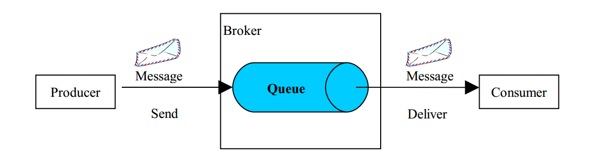
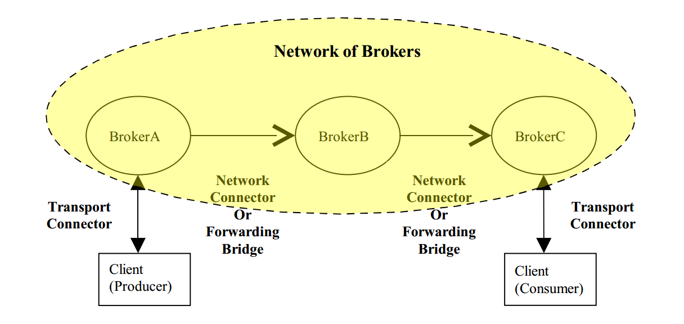

# ActiveMQ 指南
[TOC]

## 1. 简介
ActiveMQ 是最流行，最强大的开源消息库，有以下特点：

* 支持多种消息协议，如OpenWire, Stomp, AMQP, MQTT

* 支持许多高级消息特性，如消息持久化，通配符，集群等。

* 完全支持JMS协议

* 支持SPRING集成，并且可以作为嵌入式broker跟随spring启动

## 2. 快速入门

在开始本章前，需了解以下术语：

* broker: 消息服务器，负责接受、处理、分发消息；

* queue: 消息管道，发送端与接收端只能一对一传输消息；


* topic: 消息主题，接收端订阅topic后可以收到发送端发出的消息；


* producer: 消息的发送者

* consumer: 消息的接收者，按照消息类别分为QueueReceiver与TopicSubscriber


### 2.1 安装
下载ActiveMQ最新的stable版本，apache-activemq-x.x.x-bin.zip，解压至某文件夹。

### 2.2 启动
用命令行打开ActiveMQ目录，输入`bin\activemq start`即可启动broker。

在浏览器中输入URL: http://127.0.0.1:8161/admin/ ，登录用户名与密码均为admin，打开后即可看到broker管理界面

* Home页面可以看到broker的基本信息，如版本，启动时间等；

* Queues页面是queue管道管理页面，该页面显示所有queue的状态信息，可以创建/清空/删除queue，向指定的queue发送消息，或查询到指定queue的producer与consumer

* Topics页面是topic主题管理页面，该页面显示所有topic的状态信息；可以选择发送、创建、删除等操作，也可以查询到指定topic的producer与subscriber

* Connections页面展示当前所有连接信息，以消息协议分类显示

* Network页面展示的是broker的桥接信息

* Scheduled页面展示所有的消息发送计划

* Send页面用来在web页面发送定制消息

* 另外，每个页面右侧都会有一个快速导航栏，可以快速跳转到当前broker上存在的Queue，Topic，Subscribers信息

## 3. 在Java中使用ActiveMQ

下面我们以openwire作为默认消息协议，使用ActiveMQ进行Java消息开发；

注：ActiveMQ开发须依赖activemq-core.jar，请使用Maven或Gradle进行构建。
```
<!--Maven-->
<dependency>
    <groupId>org.apache.activemq</groupId>
    <artifactId>activemq-core</artifactId>
    <version>5.7.0</version>
</dependency>

//Gradle
compile group: 'org.apache.activemq', name: 'activemq-core', version:'5.7.0'
```

### 3.1 连接broker

不论是发送消息，还是接受消息，首先需要连接broker，代码如下：
```java
//broker连接信息，broker各协议端口配置信息位于broker所在目录的conf/activemq.xml中
ActiveMQConnectionFactory factory = new ActiveMQConnectionFactory(null, null, connURL);
Connection connection = factory.createConnection();
connection.start();

//创建连接会话，第一个参数为是否使用事务，使用事务时，如果事务回滚，即使已经接受的消息也会再次发送
//第二个参数控制消息接受，AUTO_ACKNOWLEDGE会自动标记消息接受状态，CLIENT_ACKNOWLEDGE则需收信端调用消息的acknowledge方法签收
Session session = connection.createSession(false, Session.AUTO_ACKNOWLEDGE);
```

### 3.2 发送消息
发送消息首先需要确定消息类型是Topic还是Queue来创建producer，然后创建消息进行发送
```java
//创建/连接Topic
Destination dest = new ActiveMQTopic(“topicName”);
//创建/连接Queue
Destination dest = new ActiveMQQueue(“queueName”);

//创建Producer
MessageProducer producer = session.createProducer(dest);
//消息持久化，若设为NON_PERSISTENT，则当broker关闭时，消息队列将被清空
producer.setDeliveryMode(DeliveryMode.PERSISTENT);

//创建文本消息
TextMessage textMessage = session.createTextMessage(msg);
producer.send(textMessage);
```

### 3.3 接受消息
与发送消息一致，接受消息同样需要先确定Destination是Queue还是Topic，代码如下：
```java
//创建/连接Topic
Destination dest = new ActiveMQTopic(“topicName”);
//创建/连接Queue
Destination dest = new ActiveMQQueue(“queueName”);

MessageConsumer consumer = session.createConsumer(dest);
//响应式接受消息
consumer.setMessageListener(new MessageListener() {
    @Override
    public void onMessage(Message message) {
        try {
            String msg = ((TextMessage)message).getText();
            log.info(msg);
        } catch (JMSException e) {
            log.error(e);
        }
    }
});
```

需要注意的是，在发送/接受完消息之后，要记得使用`connection.close();`来关闭消息连接；

## 4. 高级特性

### 4.1 发送其他消息

除了文本消息TextMessage以外，ActiveMQ还支持多种消息类型：

* ObjectMessage
发送/接受序列化的对象
```java
//发送ObjectMessage，传入的对象必须是序列化对象
ObjectMessage message = session.createObjectMessage(object);
producer.send(message);

//接受ObjectMessage，可根据对象类型进行转型
Object object = ((ObjectMessage)message).getObject();
```

* BytesMessage
发送/接受字节消息
```java
//发送BytesMessage
BytesMessage message = session.createBytesMessage();
message.writeBytes(bytes);
producer.send(message);

//接受BytesMessage
byte[] b = new byte[1024]
((BytesMessage)message).readBytes(b);
```

* StreamMessage
发送/接受stream对象，用法与BytesMessage类似
```java
//发送StreamMessage
StreamMessage message = session.createStreamMessage();
message.writeBytes(bytes);
producer.send(message);

//接受StreamMessage
byte[] b = new byte[1024]
((StreamMessage)message).readBytes(b);
```

* MapMessage
发送/接受Map消息
```java
//发送MapMessage
MapMessage message = session.createMapMessage();
message.setInt("age", 11);
producer.send(message);

//接受MapMessage
byte[] b = new byte[1024]
int age = ((MapMessage)message).getInt(“age”);
```

### 4.2 延时消息与定时消息

有些情况下我们不希望消息马上发送出去，而是延迟一段事件发送，或是每隔一段事件投递一次，如果自己去写逻辑是比较麻烦的。ActiveMQ提供了broker端的消息定时调度机制，使用时只需在发送端设置消息的调度参数，broker端的调度器就会按照我们的要求去处理消息。

调度参数一共有四个：

参数名 | 参数类型 | 参数含义
 -- | -- | --
 AMQ_SCHEDULED_DELAY | long |	延迟投递的时间
AMQ_SCHEDULED_PERIOD | long	|重复投递的时间间隔
AMQ_SCHEDULED_REPEAT | int | 重复投递次数
AMQ_SCHEDULED_CRON | String | Cron表达式

延迟60s：
```java
long time = 60 * 1000;
message.setLongProperty(ScheduledMessage.AMQ_SCHEDULED_DELAY, time);
producer.send(message);
```

初始延迟30s，投递10次，间隔10s：
```java
long delay = 30 * 1000;
long period = 10 * 1000;
int repeat = 9;
message.setLongProperty(ScheduledMessage.AMQ_SCHEDULED_DELAY, delay);
message.setLongProperty(ScheduledMessage.AMQ_SCHEDULED_PERIOD, period);
message.setIntProperty(ScheduledMessage.AMQ_SCHEDULED_REPEAT, repeat);
producer.send(message);
```

使用CRON表达式：
```java
message.setStringProperty(ScheduledMessage.AMQ_SCHEDULED_CRON, "0 * * * *");
producer.send(message);	
```

### 4.3 消息过滤

ActiveMQ提供了一种消息过滤机制，首先在发送端使用`set**Property()`方法设置消息的特定属性，然后在接收端创建Consumer时，指定过滤条件，这样消息接收端只能收到符合过滤条件的消息。示例如下：

发送端：
```java
//设置消息的属性并发送
Message message = session.createTextMessage("Hello");
message.setStringProperty("name", "Kidd");
message.setIntProperty("age", 11);
producer.send(dest, message);
```

接受端：
```java
//创建Consumer时设置过滤条件，过滤语句写法类似SQL，符合SQL-92标准即可
Consumer consumer = session.createConsumer(dest, "age > 10 and name = 'Kidd'");
```

### 4.4 消息持久化

ActiveMQ支持消息持久化，即将未投递的消息保存在broker中，即使broker宕机，下次启动后，未投递的消息仍会存在并继续投递。

#### 4.4.1 持久化设置

##### 4.4.1.1 发送端持久化设置

发送端持久化设置很简单，只需一行代码：
`producer.setDeliveryMode(DeliveryMode.PERSISTENT);`

##### 4.4.1.2 Topic消息持久化设置

注：由于Queue消息只能由一个consumer接受，因此无需更多的持久化设置。

Topic每个消息都可能有多个消费者，默认情况下，发送端发出消息，如果接收端没有订阅或已订阅但处于离线状态，消息会被其他消费者消费，然后移出broker消息队列。即使该消费者再次上线，也无法收到该消息。

简而言之，持久化订阅与非持久化订阅的区别在于能否接收自身离线状态下错过的消息；

持久化订阅配置如下：
```java
//首先需要在接收端创建连接后设置ClientId
connection.setClientID("KiddClientId");

···

//在创建Consumer时使用持久化订阅，第二个参数为订阅名称
MessageConsumer consumer = session.createDurableSubscriber(dest, "KiddSubscriber");
```
clientId与subscriberName会在内部生成一个独特的id储存在broker中，这样只要订阅成功，就不会错过任何的消息了。

#### 4.4.2 消息持久化数据库的选择

ActiveMQ支持多种消息持久化的储存方式，就目前的版本来说（5.15.0），ActiveMQ默认的数据库是其内置的文件储存数据库kahaDB。目前常用的持久化储存方式有以下三种：

* JDBC

数据库的存储方式，最大的优点可以看到消息是如何存储的，可以通过SQL查询消息消费状态，可以查看消息内容，这是其他持久化方式所不具备的。但其最大的缺点在于性能，相较其他储存方式要慢得多。

以mysql为例，jdbc配置如下：
```xml
<persistenceAdapter>
    <jdbcPersistenceAdapter dataSource="kidd-mysql"/>
</persistenceAdapter>
<bean id="kidd-mysql" class="org.apache.commons.dbcp.BasicDataSource" destroy-method="close">
    <property name="driverClassName" value="com.mysql.jdbc.Driver"/> 
    <property name="url" value="jdbc:mysql://localhost/activemq?relaxAutoCommit=true"/> 
    <property name="username" value="activemq"/> 
    <property name="password" value="activemq"/> 
    <property name="maxActive" value="200"/> 
    <property name="poolPreparedStatements" value="true"/> 
</bean>

```


* kahaDB

kahaDB是从ActiveMQ 5.4开始默认的持久化插件，KahaDb恢复时间远远小于JDBC并且使用更少的数据文件。kahaDB的持久化机制是基于日志文件，索引和缓存，所有的Destination都使用一个索引文件。它可以支持10000个连接，每个连接都是一个独立的Queue，足以满足大部分应用场景。

配置文件如下：
```xml
<persistenceAdapter>
    <kahaDB directory="${activemq.data}/kahadb"/>
</persistenceAdapter>
```

* LevelDB

从ActiveMQ 5.6版本之后，又推出了LevelDB的持久化引擎。LevelDB持久化性能高于KahaDB，虽然目前默认的持久化方式仍然是KahaDB，但是 LevelDB是将来的趋势。并且，在ActiveMQ 5.9版本提供了基于LevelDB和Zookeeper的数据复制方式，用于Master-slave方式的首选数据复制方案。LevelDB使用自定义的索引代替常用的BTree索引。

配置文件如下：
```xml
<persistenceAdapter>
    <levelDB directory="${activemq.data}/activemq-data"/>
</persistenceAdapter>
```


### 4.5 broker桥接
ActiveMQ支持broker的桥接，可以单向将broker A收到的消息转发至broker B中，也可以双向地是broker A与broker B共享消息，如下图：



桥接的配置很简单，静态单向桥接：
```xml
<networkConnectors>
  <networkConnector uri="static:(tcp://host1:61616,tcp://host2:61616,tcp://..)"/>
</networkConnectors>
```

静态双向桥接，在单向桥接的基础上加了duplex的参数：

```xml
<networkConnectors>
  <networkConnector duplex="true" uri="static:(tcp://host1:61616)"/>
</networkConnectors>
```

当然，ActiveMQ的桥接方式并不止这两种，还有更多的桥接如动态网络发现，主从桥接等等，请大家在官方文档自行查阅；

### 4.5 嵌入式broker
嵌入式broker是指不再使用独立的broker服务器，而是在项目启动时附带启动一个broker。相对于独立使用的broker，嵌入式broker更加便携，并且可以在局域网中使用。
嵌入式broker的配置有多种方式，如在java代码中配置、xbean的方式配置等，下面主要介绍一下在java代码中如何配置嵌入式的broker：

```java
//创建broker
brokerService = new BrokerService();
//指定broker名称
brokerService.setBrokerName(getBrokerName());
//指定broker的传输URI，数组形式，可指定多个
brokerService.setTransportConnectorURIs(getConnectorUris().toArray(new String[]{}));

//配置broker的安全信息
SimpleAuthenticationPlugin authenticationPlugin = new SimpleAuthenticationPlugin();
AuthenticationUser user = new AuthenticationUser(getAdminUserName(), getAdminPassword(), ADMIN_GROUP);
authenticationPlugin.setUsers(Collections.singletonList(user));
brokerService.setPlugins(new BrokerPlugin[]{authenticationPlugin});

//配置broker持久化形式与储存位置
KahaDBPersistenceAdapter persistenceAdapter = new KahaDBPersistenceAdapter();
persistenceAdapter.setDirectory(new File(getPersistenceDirectory()));
brokerService.setPersistenceAdapter(persistenceAdapter);

//启动broker
brokerService.start();
```


## 5 在spring中使用ActiveMQ

ActiveMQ只是JMS标准的一种实现，spring提供了spring-jms作为jms的封装，通过与spring-jms结合，ActiveMQ可以发挥出更大的功效。

使用前须在依赖中引入spring-jms：
```
<!--Maven-->
<dependency>
    <groupId>org.springframework</groupId>
    <artifactId>spring-jms</artifactId>
    <version>5.0.1.RELEASE</version>
</dependency>

//Gradle
compile group: 'org.springframework', name: 'spring-jms', version:'5.0.1.RELEASE'
```

下面介绍spring-jms的常见用法

### 5.1 发送消息（JmsTemplate）
spring-jms中提供的最有用的类应该就是JmsTemplate了，类似于JdbcTemplate，JmsTemplate可以帮助我们减少重复代码，并提供统一的发送、接受消息的API。

JmsTemplate主要用于发送消息或主动接受消息，用法可参考其api文档，其在spring文件中配置如下：

```xml
<!-- 真正可以产生Connection的ConnectionFactory，由对应的 JMS服务厂商提供-->
<bean id="connectionFactory" class="org.apache.activemq.ActiveMQConnectionFactory">
    <property name="brokerURL" value="${client.brokerURL}"/>
    <property name="userName" value="${client.username}"/>
    <property name="password" value="${client.password}"/>
</bean>

<!-- Spring提供的JMS工具类，它可以进行消息发送、主动接收等 -->
<bean id="jmsTemplate" class="org.springframework.jms.core.JmsTemplate">
    <!-- 这个connectionFactory对应的是我们定义的Spring提供的那个ConnectionFactory对象 -->
    <property name="connectionFactory" ref="connectionFactory"/>
    <!-- 如果为true则直接指定字符串destination时发送的是topic，否则为queue -->
    <property name="pubSubDomain" value="true"/>
</bean>
```

### 5.2 接受消息（MessageListenerContainer）

MessageListenerContainer主要用于被动接受消息，设置destination后，发往该destination的消息都会经过处理。在spring文件中配置如下：

```xml
<!-- 真正可以产生Connection的ConnectionFactory，由对应的 JMS服务厂商提供-->
<bean id="connectionFactory" class="org.apache.activemq.ActiveMQConnectionFactory">
    <property name="brokerURL" value="${client.brokerURL}"/>
    <property name="userName" value="${client.username}"/>
    <property name="password" value="${client.password}"/>
</bean>

<!-- 消息监听器，继承MessageListener，重写OnMessage函数处理消息 -->
<bean id="listener" class="com.kidd.demos.amq.spring.embedded.Listener"/>

<!-- 消息监听容器，配置连接、id、destination等 -->
<bean class="org.springframework.jms.listener.DefaultMessageListenerContainer">
    <property name="connectionFactory" ref="connectionFactory"/>
    <property name="subscriptionDurable" value="true"/>
    <property name="clientId" value="kidd"/>
    <property name="destination" ref="kiddTopic"/>
    <!--destination与destinationName只配置一个，destinationName为动态destination-->
    <property name="destinationName" value="kiddDestination"/>
    <!--配置destinationName时使用，true则将destination作为topic处理，否则为queue-->
    <property name="pubSubDomain" value="true"/>
    <property name="messageListener" ref="listener"/>
</bean>
```

---
本文只介绍了ActiveMQ中最常用的一部分，更多的内容等待大家自己去探索。（完）